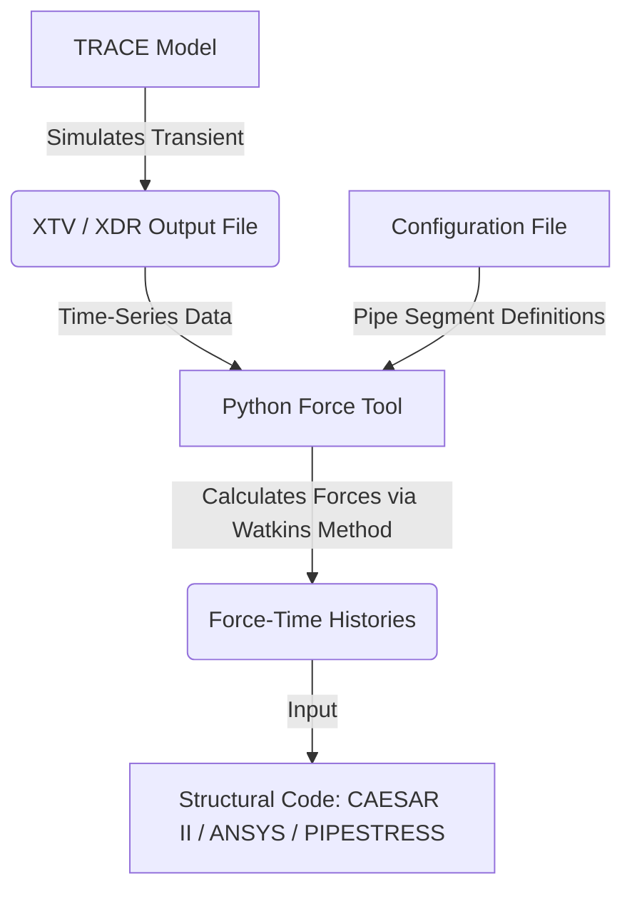

# Research Summary: R5FORCE and Fluid-Induced Piping Force Calculations

This document summarizes the research on **R5FORCE** (and its MOD3s variant), the standard methodology for fluid-induced piping force calculations in system codes, the reference documents found in your OneDrive folder, and a conceptual plan for developing a similar post-processing tool for the **TRACE** code.

---

## 1. References Identified
During the search, we located several critical reference documents, which have been copied directly to the repository:
`[references](references/)`

### Key Reference Files
1. **R5FORCE User Manual**: 
   * **Path**: [R5FORCEMOD3-EGG-EAST-9232-6341078.pdf](references/r5force/R5FORCEMOD3-EGG-EAST-9232-6341078.pdf)
   * **Report ID**: EGG-EAST-9232 (EG&G Idaho, 1990)
   * **Details**: Documents the *R5FORCE/MOD3s* code designed to compute fluid-induced force/time histories using hydrodynamic output from RELAP5/MOD3.
2. **RELAP5/MOD3 Code Manual (Volume 5: User's Guidelines)**:
   * **Path**: [NUREGCR-5535-RELAP5MOD3CodeMAN-VOL5-ML110380261.pdf](references/r5force/NUREGCR-5535-RELAP5MOD3CodeMAN-VOL5-ML110380261.pdf)
   * **Details**: Provides standard guidelines on modeling transients that generate dynamic loads (e.g., Courant limit guidelines, nodalization requirements).
3. **NuScale Short-Term Transient Analysis (HELB)**:
   * **Path**: [NUSCALE-HELB-R5force-ref-ML17005A132.pdf](references/r5force/NUSCALE-HELB-R5force-ref-ML17005A132.pdf)
   * **Details**: An NRC ADAMS public document (Accession No. ML17005A132) detailing how NuScale performed transient calculations (e.g., blowdown, main steam, and feedwater line breaks) using NRELAP5 and structural codes.
4. **Fauske & Associates Technical Bulletin N-15-04**:
   * **Path**: [Tech_bulletin_N-15-04.pdf](references/Tech_bulletin_N-15-04.pdf)
   * **Details**: Summarizes dynamic loads in piping systems (specifically relief valve and rupture disk discharges) and outlines the coupling between thermal-hydraulic analysis (RELAP5) and structural stress analysis (PIPESTRESS).

---

## 2. Mathematical Background: The Watkins Formulation
Piping forces during rapid transients (e.g., water hammer, blowdown, or valve closure) are driven by pressure wave propagation and momentum flux changes. 

### The Control Volume Method (Legacy Approach)
In a traditional control volume (CV) approach, the dynamic force exerted by the fluid on a pipe segment (defined between inlets and outlets) is derived from the conservation of momentum:

$$\vec{F}_{\text{fluid} \rightarrow \text{wall}} = \oint_{\text{boundaries}} P \vec{n} \, dA + \oint_{\text{boundaries}} \rho \vec{v} (\vec{v} \cdot \vec{n}) \, dA + \vec{W}_{\text{fluid}} - \vec{F}_{\text{accel}}$$

Where:
* **Pressure Boundary Force**: $\oint P \vec{n} \, dA = P_1 A_1 \vec{n}_1 + P_2 A_2 \vec{n}_2$
* **Momentum Flux Force**: $\oint \rho \vec{v} (\vec{v} \cdot \vec{n}) \, dA = \dot{m}_1 \vec{v}_1 - \dot{m}_2 \vec{v}_2$
* **Weight of Fluid**: $\vec{W}_{\text{fluid}} = \int_V \rho \vec{g} \, dV$
* **Acceleration (Wave) Force**: $\vec{F}_{\text{accel}} = \frac{d}{dt} \int_V \rho \vec{v} \, dV$

> [!WARNING]
> **The Numerical Differentiation Problem**: Calculating $\vec{F}_{\text{accel}}$ requires taking the time derivative of the mass flow rate ($\frac{d\dot{m}}{dt}$) or velocity. Since system thermal-hydraulic codes (RELAP5, TRACE) use discrete time steps and spatial nodes, their output contains high-frequency numerical oscillations. Taking numerical derivatives of this data severely amplifies noise, yielding highly unstable force histories.

### The Watkins Pressure-Shear Formulation (R5FORCE Approach)
To eliminate numerical differentiation instabilities, J.C. Watkins (1990) reformulated the equation by substituting the acceleration term using the integrated fluid momentum conservation equation itself:

$$\frac{\partial (\rho v A)}{\partial t} = - \frac{\partial (P A)}{\partial x} - \frac{\partial (\dot{m} v)}{\partial x} - f_{\text{wall}} - \rho g A \cos\theta$$

By integrating this over the internal volumes, the boundaries cancel out with the pressure and momentum flux terms. The net force acting on the pipe segment is rewritten directly in terms of:
1. **Wall Friction (Shear)**: The integral of the wall shear stress ($\int \tau_w P_w \, dx$) over the segment length.
2. **Form Losses (Pressure Drops)**: Minor losses across expansions, contractions, orifices, and valves.
3. **Pressure on Discontinuities**: The net pressure acting on unequal areas (e.g. contractions/expansions) and projected area changes at bends/elbows.
4. **Gravity**: The gravitational component acting along the pipe axis.

This formulation is **numerically stable** because it avoids calculating $\frac{d}{dt}$ of mass flow, relying instead on integrated variables directly output by the thermal-hydraulic code.

---

## 3. Developing a Similar Tool for TRACE

To build a similar force-estimation tool for TRACE, we can design a Python-based post-processor. 

### Proposed Tool Architecture


### 4. Mathematical Details of the Watkins Formulation

Based on the R5FORCE/MOD3s manual, the following equations govern the calculations for fluid-induced piping forces:

#### A. Two-Phase Mixture Momentum Flux
The momentum flux term ($\rho u^2$) for two-phase flow is computed as:
$$\rho u^2 = \alpha \rho_g u_g^2 + (1 - \alpha) \rho_f u_f^2$$
Where:
* $\alpha$ is the void fraction (`VOID` in TRACE)
* $\rho_g, \rho_f$ are the gas and liquid densities (`RHOV` and `RHOL` in TRACE)
* $u_g, u_f$ are the gas and liquid velocities (`VV` and `VL` in TRACE)

#### B. Wall Shear Force
The shear force ($F_{\text{shear}}$) exerted on the pipe walls of a volume cell is computed directly from the wall friction coefficient per unit volume ($FW_g$ and $FW_f$):
$$F_{\text{shear,cell}} = (FW_g + FW_f) \cdot A \cdot L$$
Where:
* $FW_g, FW_f$ are the gas and liquid wall friction terms per unit volume
* $A$ is the cross-sectional flow area
* $L$ is the cell length

#### C. Friction Loss Modeling at Discontinuities (Elbows)
In R5FORCE, dynamic forces are computed using the wall shear force. Form losses (elbows) are modeled by modifying the volume roughness ($\epsilon$) of the adjacent volumes, rather than adding form loss coefficients ($K$) at junctions.
The equivalent turbulent friction factor ($f_e$) for the volume cell is:
$$f_e = f_t \left(1 + \frac{(L/D)_L}{(L/D)_v}\right)$$
Where:
* $(L/D)_L = \frac{K}{f_t}$ is the equivalent length-to-diameter ratio of the elbow loss
* $(L/D)_v = \frac{L_v}{D_v}$ is the length-to-diameter ratio of the volume cell
* $f_t$ is the turbulent friction factor calculated using the Colebrook equation:
  $$\frac{1}{\sqrt{f_t}} = -2 \log_{10}\left(\frac{\epsilon}{3.7 D}\right)$$

The equivalent volume roughness ($\epsilon_e$) to be input into the system code is:
$$\epsilon_e = 3.7 \cdot D \cdot 10^{-\frac{1}{2\sqrt{f_e}}}$$

---

### 5. Proposed TRACE Tool Implementation Steps

1. **Extract TRACE Hydrodynamics**:
   * Use the existing python utility [`xtvReader.py`](../TRACE-CmakeBuild/Scripts/xtvReader.py) (found in the `TRACE-CmakeBuild` repo) to parse the TRACE binary XTV output files (`Steady.xtv`, `Transient.xtv`, etc.).
   * Extract time-series values for:
     * Cell Pressures ($P_k$) -> `P`
     * Cell Void Fractions ($\alpha_k$) -> `VOID`
     * Phasic Densities ($\rho_{g,k}, \rho_{f,k}$) -> `RHOV`, `RHOL`
     * Phasic Velocities ($u_{g,j}, u_{f,j}$) -> `VV`, `VL` (at junctions)
     * Phasic Wall Drag Coefficients -> `FW`
2. **Geometry and Segment Mapping**:
   * Define a YAML input file where the user specifies the pipe segments. For example:
     ```yaml
     - segment_name: "LPI_Segment_A"
       cells: [ "PIPE-10-1", "PIPE-10-2", "PIPE-10-3" ] # Component & Cell IDs
       inlet_vector: [ 1.0, 0.0, 0.0 ] # Flow direction vector
       outlet_vector: [ 0.0, 1.0, 0.0 ] # 90-degree elbow
     ```
3. **Friction and Form Loss Integration**:
   * Compute the momentum flux and wall shear forces for each cell in the segment using the Watkins equations.
   * If elbows are modeled using form loss coefficients ($K$) in the TRACE deck, the tool should either automatically convert them to equivalent wall friction forces or directly sum the junction form loss pressure forces into the segment force balance.
4. **Force-Time History Generation**:
   * Calculate the net dynamic force on each segment.
   * Output the dynamic loads in a standard format (such as `.frc` or `.th` ASCII files) suitable for structural codes (CAESAR II, PIPESTRESS, or ANSYS).

