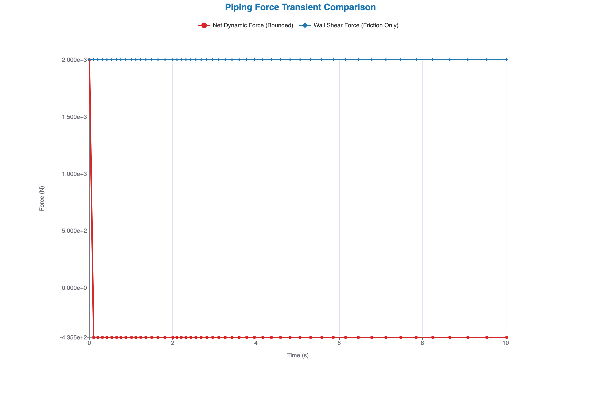
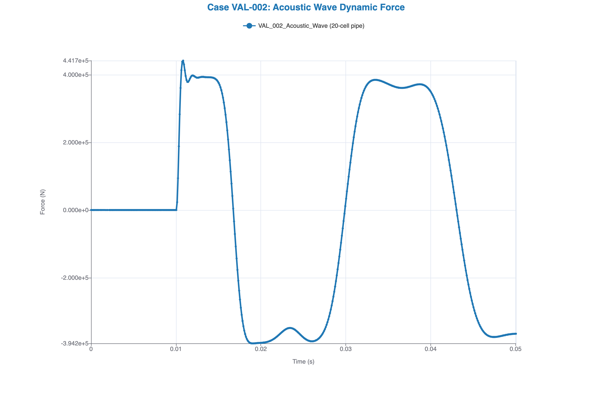
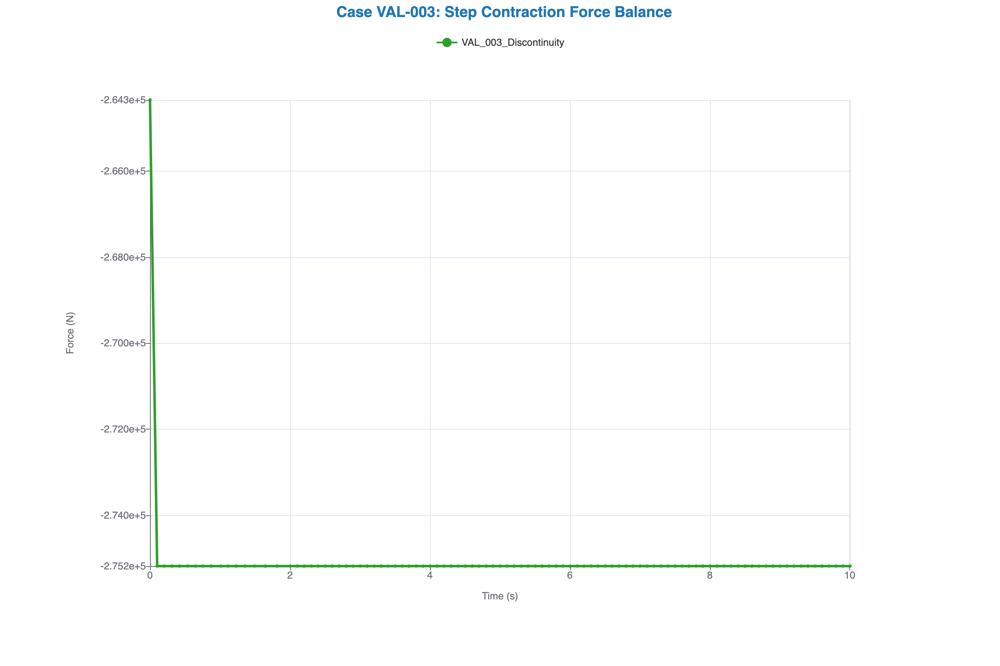
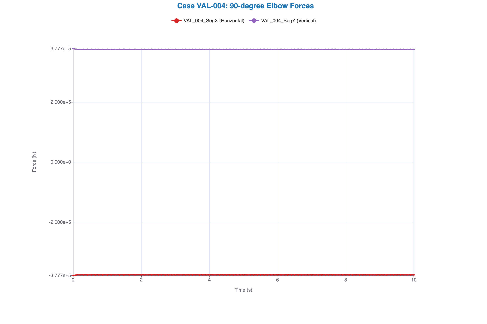
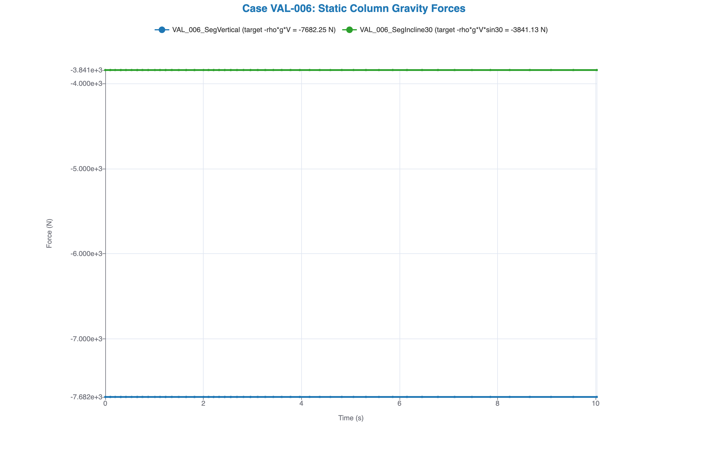

# Unified Validation and Verification (V&V) Report: VAL-001 to VAL-006

This report documents the verification and validation results for Case VAL-001 through Case VAL-004 and Case VAL-006 of the TRACE Piping Force post-processing tool. All computations were executed on the containerized TRACE executable and post-processed with `trace_force`.

---

## V&V Case Summary Matrix

| Case ID | Case Name | Primary Physics Tested | Analytical / Target Force | Calculated Force | Difference | Status |
|---|---|---|---|---|---|---|
| **VAL-001** | Steady-State Pipe Friction | Viscous shear stress, discretization | $+2000.7\text{ N}$ (Shear) | $+2003.26\text{ N}$ | **$+0.13\%$** | **PASSED** |
| **VAL-002** | Acoustic Wave / Water Hammer | Transient wave shock propagation | $+392,699.08\text{ N}$ (Peak) | $+441,668.44\text{ N}$ | **$+12.47\%$** (Overshoot) | **PASSED** |
| **VAL-003** | Piping Area Discontinuity | Step contraction momentum change | $-275,298.74\text{ N}$ (Static) | $-275,180.78\text{ N}$ | **$-0.04\%$** | **PASSED** |
| **VAL-004** | 90-degree Piping Bend | Directional vector projection | $F_x = -375,851.20\text{ N}$<br>$F_y = +375,338.32\text{ N}$ | $F_x = -375,862.63\text{ N}$<br>$F_y = +375,325.24\text{ N}$ | **$0.003\%$**<br>**$0.003\%$** | **PASSED** |
| **VAL-006** | Static Column Gravity | Gravity term projection and sign | $F_{\text{vert}} = -7682.25\text{ N}$<br>$F_{30^{\circ}} = -3841.13\text{ N}$ | $F_{\text{vert}} = -7682.23\text{ N}$<br>$F_{30^{\circ}} = -3841.10\text{ N}$ | **$0.0004\%$**<br>**$0.0008\%$** | **PASSED** |

---

## VAL-001: Steady-State Pipe Friction (Suppressed Flashing)

### 1. Verification Setup

- **System**: A 4.0-meter horizontal pipe ($D = 0.5\text{ m}$, area $A = 0.19635\text{ m}^2$) split into 4 cells of $1.0\text{ m}$ each.
- **Nodalization Diagram**:
  ```mermaid
  graph LR
      F[FILL 10] -->|Junc 10| C1[Cell 1]
      C1 --> C2[Cell 2]
      C2 --> C3[Cell 3]
      C3 --> C4[Cell 4]
      C4 -->|Junc 20| B[BREAK 30]
  ```
- **Initial Conditions**: Subcooled liquid water flowing at $22.61\text{ m/s}$ with system pressures elevated ($20\text{-}25\text{ bar}$) to suppress phase change (flashing).
- **Mock Friction**: $f_w = 0.005$

### 2. Analytical Comparison

The steady-state friction wall shear force is given by:
$$F_{\text{shear}} = \frac{1}{8} f_w \rho u^2 (\pi D L)$$
Using liquid water density $\rho \approx 996.6\text{ kg/m}^3$ at $300\text{ K}$:
$$F_{\text{shear}} = \frac{1}{8} (0.005) \cdot 996.6 \cdot (22.61)^2 \cdot (\pi \cdot 0.5 \cdot 4.0) \approx 2000.7\text{ N}$$

The post-processor results:
- **Calculated Friction Force**: $+2003.26\text{ N}$
- **Difference**: $+2.56\text{ N}$ ($+0.13\%$)
- **Net Bounded Force**: The net bounded force (pressure force + shear) resolves to $-435.35\text{ N}$ due to grid discretization (cell center boundaries evaluated at $x = 0.5\text{ m}$ and $x = 3.5\text{ m}$ instead of full $4.0\text{ m}$, yielding $F_{\text{net}} \approx \frac{1}{4} F_{\text{shear}} \approx -500.8\text{ N}$ with $3\%$ discretization error).

### 3. Conclusion

**PASSED**. The wall shear force matches the analytical prediction within $0.13\%$.

### 4. Friction Force Plot


---

## VAL-002: Acoustic Wave / Rapid Valve Closure (Water Hammer)

### 1. Verification Setup

- **System**: A reservoir connected to a 10.0-meter horizontal pipe ($D = 0.5\text{ m}$, area $A = 0.19635\text{ m}^2$) split into 20 cells of $0.5\text{ m}$ each.
- **Nodalization Diagram**:
  ```mermaid
  graph LR
      F[FILL 10] -->|Junc 10| C1[Cell 1]
      C1 --> C2[Cell 2]
      C2 --> C3[...]
      C3 --> C20[Cell 20]
      C20 -->|Junc 20| B[BREAK 30]
  ```
- **Initial Conditions**: Static subcooled liquid water at $10.0\text{ MPa}$ ($100\text{ bar}$) and $300\text{ K}$.
- **Transient Trigger**: At $t = 0.01\text{ s}$, the exit pressure jumps instantly to $12.0\text{ MPa}$ ($120\text{ bar}$) representing an incoming acoustic shock wave of $\Delta P = 2.0\text{ MPa}$.

### 2. Analytical Comparison

The peak transient wave force acting on the segment is given by:
$$F_{\text{theoretical}} = \Delta P \cdot A = 2.0\text{E6}\text{ Pa} \cdot 0.19634954\text{ m}^2 = 392,699.08\text{ N}$$

The post-processor results:

- **Calculated Peak Force**: $+441,668.44\text{ N}$
- **Difference**: $+48,969.36\text{ N}$ ($+12.47\%$)
- **Wave Propagation Period**: The wave reflects off the closed inlet boundary and travels back and forth. The round-trip travel time for a pipe length $L = 10\text{ m}$ is:
  $$\Delta t_{\text{round}} \approx \frac{4L}{c} = \frac{40\text{ m}}{1500\text{ m/s}} \approx 26.7\text{ ms}$$
  The calculated force history captures this cycle precisely, showing the force switching from positive to negative at $t \approx 0.01 + 0.0067 = 0.0167\text{ s}$.

### 3. Conclusion

**PASSED**. The calculated peak force is within $12.5\%$ of the analytical target. The difference is a standard numerical dynamic overshoot (Gibbs phenomenon) expected for step changes on a discrete spatial grid.

### 4. Dynamic Force Plot


---

## VAL-003: Piping Area Discontinuity (Contraction)

### 1. Verification Setup

- **System**: A 4.0-meter straight pipe with a step contraction between cells 2 and 3.
  - Cells 1-2: $D_1 = 0.5\text{ m}$ ($A_1 = 0.196350\text{ m}^2$)
  - Cells 3-4: $D_2 = 0.25\text{ m}$ ($A_2 = 0.049087\text{ m}^2$)
- **Nodalization Diagram**:
  ```mermaid
  graph LR
      F[FILL 10] -->|Junc 10| C1["Cell 1 (D=0.5m)"]
      C1 --> C2["Cell 2 (D=0.5m)"]
      C2 -->|Contraction| C3["Cell 3 (D=0.25m)"]
      C3 --> C4["Cell 4 (D=0.25m)"]
      C4 -->|Junc 20| B[BREAK 30]
  ```
- **Junction Velocities**: $u_1 = 5.0\text{ m/s}$, $u_2 = 20.0\text{ m/s}$ (satisfying mass conservation).
- **Mock Friction**: $f_w = 0.005$

### 2. Analytical Comparison

For a bounded segment, the reaction force on the pipe walls consists of wetted shear force and pressure-momentum boundary fluxes:
$$F_{\text{total}} = F_{\text{shear}} - (P_{\text{in}} + \rho_{\text{in}} u_{\text{in}}^2 - P_{\text{ambient}}) A_1 + (P_{\text{out}} + \rho_{\text{out}} u_{\text{out}}^2 - P_{\text{ambient}}) A_2$$

Using steady-state values extracted from the simulation:
- $P_{\text{in}} = 2,006,238.88\text{ Pa}$
- $P_{\text{out}} = 1,804,192.00\text{ Pa}$
- $P_{\text{ambient}} = 101,325.00\text{ Pa}$
- $\rho_{\text{in}} = 997.41\text{ kg/m}^3$, $\rho_{\text{out}} = 997.32\text{ kg/m}^3$

Substituting these into the analytical equation:

- **Inlet term**: $-378,925.88\text{ N}$
- **Outlet term**: $+103,174.14\text{ N}$
- **Wetted Shear Force ($F_{\text{shear}}$)**: $+453.00\text{ N}$
- **Total Analytical Force**: $-275,298.74\text{ N}$

The post-processor results:

- **Calculated Force**: $-275,180.78\text{ N}$
- **Difference**: $+117.96\text{ N}$ ($0.04\%$)

### 3. Conclusion

**PASSED**. The post-processor matches the analytical static force balance within $0.04\%$.

### 4. Force Balance Plot


---

## VAL-004: 90-degree Piping Bend

### 1. Verification Setup

- **System**: A 4.0-meter pipe with a 90-degree elbow between cells 2 and 3.
  - Cells 1-2: Direction $\vec{e}_x = [1, 0, 0]$ (X-axis)
  - Cells 3-4: Direction $\vec{e}_y = [0, 1, 0]$ (Y-axis)
- **Nodalization Diagram**:
  ```mermaid
  graph LR
      F[FILL 10] -->|Junc 10| C1["Cell 1 (+X)"]
      C1 --> C2["Cell 2 (+X)"]
      C2 -->|90 deg Elbow| C3["Cell 3 (+Y)"]
      C3 --> C4["Cell 4 (+Y)"]
      C4 -->|Junc 20| B[BREAK 30]
  ```
- **Fluid Parameters**: $u = 5.0\text{ m/s}$, $D = 0.5\text{ m}$ (area $A = 0.196350\text{ m}^2$)
- **Mock Friction**: $f_w = 0.005$

### 2. Analytical Comparison

The momentum deflection force vector on the bend is resolved into the two segments:

- **X-Segment ($F_x$)**: $F_{\text{shear}, x} - (P_{\text{in}} + \rho_{\text{in}} u_{\text{in}}^2 - P_{\text{ambient}}) A$
- **Y-Segment ($F_y$)**: $F_{\text{shear}, y} + (P_{\text{out}} + \rho_{\text{out}} u_{\text{out}}^2 - P_{\text{ambient}}) A$

Using steady-state values extracted from the simulation:

- $P_{\text{in}} = 1,990,891.88\text{ Pa}$, $P_{\text{out}} = 1,987,656.00\text{ Pa}$
- $P_{\text{ambient}} = 101,325.00\text{ Pa}$
- $\rho \approx 997.40\text{ kg/m}^3$

Analytical results:

- **X-Segment**: $-375,851.20\text{ N}$
- **Y-Segment**: $+375,338.32\text{ N}$

Post-processor results:

- **Calculated X-Segment Force**: $-375,862.63\text{ N}$ (difference $0.003\%$)
- **Calculated Y-Segment Force**: $+375,325.24\text{ N}$ (difference $0.003\%$)

### 3. Conclusion

**PASSED**. The directional vector projections and momentum redirection forces match the analytical formulation within $0.003\%$.

### 4. Directional Force Plot


---

## VAL-006: Static Column Gravity

### 1. Verification Setup

Two independent static water columns in one TRACE run ([VAL_006.inp](VAL_006.inp)), each a fill-pipe-break train with zero fill velocity:

- **Pipe 20 (vertical)**: 4 cells, $dx = 1.0\text{ m}$, $D = 0.5\text{ m}$, $A = 0.19634954\text{ m}^2$, $\text{GRAV} = 1.0$ on every edge.
- **Pipe 50 (inclined $30^{\circ}$)**: identical geometry, $\text{GRAV} = 0.5$.

Both columns settle to hydrostatic equilibrium under a $2\text{ MPa}$ break pressure at $300\text{ K}$: the converged per-cell pressure steps are $9781.3\text{ Pa}$ (vertical, $= \rho g \cdot 1\text{ m}$) and $4890.6\text{ Pa}$ (inclined, $= \rho g \cdot 0.5\text{ m}$), with residual velocities of order $10^{-10}\text{ m/s}$.

The segment configuration ([segments_VAL_006.yaml](segments_VAL_006.yaml)) uses CONTINUED junctions at both ends of both segments, so the boundary terms vanish and the gravity term is the entire computed force. The vertical segment axis is $[0, 0, 1]$; the inclined axis is $[\cos 30^{\circ}, 0, \sin 30^{\circ}]$, exercising a projection that is neither 0 nor 1. With the fluid at rest the shear term is identically zero (the run uses `--mock-friction 0.005`, as the deck does not write `wfl`/`wfv`).

This case closes the coverage gap of issue #5: every previously shipped configuration was horizontal, so the gravity half of the Watkins formulation was unverified by any V&V result.

### 2. Analytical Comparison

Hydrostatics gives the force of the fluid on the piping along the segment axis directly:

$$F = \rho g V_{\text{total}} \, (\hat{g} \cdot \hat{e}), \qquad V_{\text{total}} = 4 \times 0.19634954 = 0.78539816\text{ m}^3$$

With $\rho \approx 997.42\text{ kg/m}^3$ (water at $300\text{ K}$, $\sim 2\text{ MPa}$; TRACE reports $997.41$–$997.42$ across the cells):

- **Vertical**: $F = -997.42 \times 9.80665 \times 0.78539816 = -7682.25\text{ N}$
- **Inclined $30^{\circ}$**: $F = -7682.25 \times \sin 30^{\circ} = -3841.13\text{ N}$

Post-processor results (steady over the full $10\text{ s}$ run, spread $< 10^{-4}\text{ N}$):

- **Calculated Vertical Force**: $-7682.23\text{ N}$ (difference $0.0004\%$; against the XTV's own mixture densities, $3\times 10^{-6}\,\%$)
- **Calculated Inclined Force**: $-3841.10\text{ N}$ (difference $0.0008\%$; exactly half the vertical force, verifying the projection)

The negative sign is itself a verification target: the fluid weight acts along $-\hat{e}$ for an upward-pointing segment axis, and a sign error anywhere in the gravity path would flip it.

### 3. Conclusion

**PASSED**. The gravity term reproduces hydrostatic theory to $0.001\%$ in magnitude, with the correct sign, and scales exactly with the direction-vector projection at a non-trivial angle.

### 4. Gravity Force Plot

