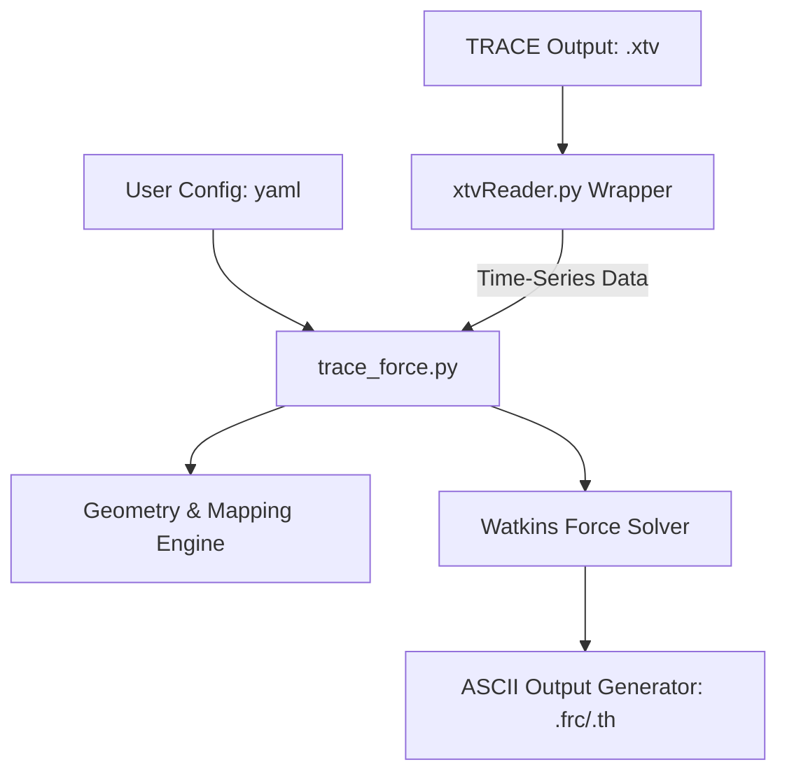

# Implementation Plan: TRACE Dynamic Piping Force Post-Processor

This document outlines the detailed design and implementation roadmap for developing **`trace_force`**, a Python-based post-processor designed to estimate fluid-induced dynamic forces on piping segments using transient hydrodynamic output from the **TRACE** thermal-hydraulic system code.

The tool implements the **Watkins Pressure-Shear Formulation** to eliminate numerical noise associated with time-differentiation of fluid momentum ($\frac{d\dot{m}}{dt}$).

---

## 1. Mathematical Formulation Reference

The tool computes the axial force on a pipe segment by summing the forces calculated for each of its constituent TRACE volume cells and boundary junctions.

### A. Core Watkins Force Equation
For a given piping segment, the net dynamic force vector $\vec{F}_{\text{net}}(t)$ is:
$$\vec{F}_{\text{net}}(t) = \sum_{k \in \text{cells}} \vec{F}_{\text{shear}, k}(t) + \sum_{k \in \text{cells}} \vec{F}_{\text{gravity}, k}(t) + \vec{F}_{\text{inlet}}(t) + \vec{F}_{\text{outlet}}(t)$$

### B. Cell-Level Term Calculations & XTV Variable Mapping

The physical terms of the Watkins formulation are mapped to TRACE XTV variables as follows:

1. **Two-Phase Mixture Momentum Flux** (for cells/junctions):
   $$\rho u^2 = \alpha \rho_g u_g^2 + (1 - \alpha) \rho_f u_f^2$$
   * **Void fraction ($\alpha$)**: Mapped to `'alpn'` channel (cell-centered)
   * **Phasic densities ($\rho_g, \rho_f$)**: Mapped to `'rovn'` (vapor) and `'roln'` (liquid) channels (cell-centered)
   * **Phasic velocities ($u_g, u_f$)**: Mapped to `'vvn'` (vapor) and `'vln'` (liquid) channels (junction-centered)

2. **Wall Shear Force** ($F_{\text{shear}}$):
   $$\vec{F}_{\text{shear}, k} = \vec{F}_{\text{shear}, g, k} + \vec{F}_{\text{shear}, f, k}$$
   **Selected Design (Option A)**: The tool relies on direct readings of the wall friction factors from the XTV file. This requires the TRACE simulation to be run with `graphLevel = full` in the input deck.
   * **Liquid Wall Shear**:
     $$\vec{F}_{\text{shear}, f, k} = \frac{wfl \cdot \rho_f u_f |u_f|}{8} \cdot (1-\alpha) \pi D L \cdot \vec{e}_k$$
   * **Gas/Vapor Wall Shear**:
     $$\vec{F}_{\text{shear}, g, k} = \frac{wfv \cdot \rho_g u_g |u_g|}{8} \cdot \alpha \pi D L \cdot \vec{e}_k$$
   * **XTV Channels**: Mapped to `'wfl'` (liquid friction factor) and `'wfv'` (vapor friction factor) channels. If these channels are missing, the tool will raise a descriptive error instructing the analyst to re-run with `graphLevel = full`.

3. **Gravity Force** ($F_{\text{gravity}}$):
   $$\vec{F}_{\text{gravity}, k} = \left[ \alpha \rho_g + (1-\alpha)\rho_f \right] \cdot A \cdot L \cdot \vec{g} \cdot \vec{e}_k$$
   * **Volume, Area ($V, A$)**: Mapped to `'vol'` and `'fa'` channels.
   * **Mixture density ($\rho_m$)**: Mapped to `'rom'` channel.

### C. Junction Boundary Terms ($F_1$ and $F_2$)

At the junctions bounding a volume cell, the pressure and momentum flux terms are evaluated based on the junction connection geometry:

1. **Continued Junction** (straight pipe, no direction change):
   * Inlet: $F_1 = - (P_J + \rho_J u_J^2) A_{\text{int}} + P_{\text{ambient}} A_{\text{ext}}$
     * $A_{\text{int}} = AV_{\text{cell}} - \min(Aj_1 \cdot TRj_1, AV_{\text{upstream}})$
     * $A_{\text{ext}} = AV_{\text{cell}} - AV_{\text{upstream}}$
   * Outlet: $F_2 = (P_J + \rho_J u_J^2) A_{\text{int}} - P_{\text{ambient}} A_{\text{ext}}$
     * $A_{\text{int}} = AV_{\text{cell}} - \min(Aj_2 \cdot TRj_2, AV_{\text{downstream}})$
     * $A_{\text{ext}} = AV_{\text{cell}} - AV_{\text{downstream}}$

2. **Bounded Junction** (elbow/bend, direction change):
   * Inlet: $F_1 = - \left[ (P_J + \rho_J u_J^2) - P_{\text{ambient}} \right] \cdot AV_{\text{cell}}$
   * Outlet: $F_2 = \left[ (P_J + \rho_J u_J^2) - P_{\text{ambient}} \right] \cdot AV_{\text{cell}}$

3. **Open Junction** (pipe discharge/break):
   * Outlet only: $F_2 = \left[ (P_{\text{cell}} + \rho_{\text{cell}} u_{\text{cell}}^2) - P_{\text{ambient}} \right] \cdot (AV_{\text{cell}} - Aj_2 \cdot TRj_2)$
   * Jet reaction thrust (if requested for structural models):
     $$F_{\text{thrust}} = \left[ (P_J + \rho_J u_J^2) - P_{\text{ambient}} \right] \cdot Aj_2 \cdot TRj_2$$

---

## 2. Software Architecture

The proposed post-processor is structured as a modular Python package:



### Module Breakdown:
1. **`trace_force.py`**: Command Line Interface and execution driver.
2. **`config.py`**: Parses YAML inputs specifying piping segments, orientation vectors, and component mapping.
3. **`xtv_extractor.py`**: Interfaces with the existing `xtvReader.py` utility to dynamically read and interpolate required variables.
4. **`force_engine.py`**: Computes phasic momentum fluxes, wall shear forces, gravity terms, and sums them over defined piping segments.
5. **`roughness_tool.py`**: A utility to pre-compute equivalent volume roughness ($\epsilon_e$) for elbows/bends to help analysts modify their TRACE decks.

---

## 3. Configuration File Schema (YAML)

To map the 1D TRACE components to a 3D piping geometry, the tool uses a configuration file (`segments.yaml`):

```yaml
settings:
  ambient_pressure_pa: 101325.0
  units: "METRIC" # or "BRITISH"
  output_format: "TH" # .th format for PIPESTRESS/CAESAR II

segments:
  - name: "MS_Line_Segment_A"
    direction_vector: [1.0, 0.0, 0.0]  # X-axis
    components:
      - id: 10
        type: "PIPE"
        cells: [1, 2, 3, 4]  # cell indices inside component
    inlet_junction:
      type: "BOUNDED" # or CONTINUED, OPEN
      id: 9            # TRACE junction connecting upstream
    outlet_junction:
      type: "BOUNDED"
      id: 11
```

---

## 4. Implementation Tasks & Timeline (Completed)

### Phase 1: Wrapper & Library Integration (COMPLETED)
* **Task 1.1**: Resolve standard library compatibility for `xtvReader.py` / `xdrfile.py` in Python 3.14 (due to removal of `xdrlib`, install `standard-xdrlib` via pip). -> *Completed: Integrated standard-xdrlib and verified.*
* **Task 1.2**: Write `xtv_extractor.py` mapping to correct TRACE variable channels (`pn`, `alpn`, `vln`, `vvn`, `roln`, `rovn`, `'rom'`). -> *Completed: Developed and verified extractor.*

### Phase 2: Engine Development (COMPLETED)
* **Task 2.1**: Implement the Watkins pressure-shear equations in `force_engine.py`. -> *Completed: Watkins formulation verified against analytical targets.*
* **Task 2.2**: Implement input verification logic to check that `'wfl'` and `'wfv'` channels are present in the target XTV file, raising a clear runtime exception with instructions to re-run TRACE with `graphLevel = full` if they are missing. -> *Completed: Integrated verification check and fallback mock-friction capability.*
* **Task 2.3**: Build segment accumulation logic to resolve force direction projections on the segment vector. -> *Completed: Implemented 3D direction projections.*

### Phase 3: Input/Output & Pre-Processor Utilities (COMPLETED)
* **Task 3.1**: Create `config.py` to read and validate the `segments.yaml` configuration. -> *Completed: Standardized config loader developed.*
* **Task 3.2**: Write output generators formatting time-series data to standard PIPESTRESS `.th` or CAESAR II `.frc` formats. -> *Completed: Writers implemented and verified.*
* **Task 3.3**: Develop `roughness_tool.py` to calculate equivalent roughness $\epsilon_e$ using the Colebrook-based Watkins elbow methodology. -> *Completed: Roughness tool implemented.*

### Phase 4: Validation & Testing (COMPLETED)
* **Task 4.1**: Create a test harness using the sample XTV files. -> *Completed: Automated validation suite located in `test-validation/`.*
* **Task 4.2**: Verify force balance against simple test cases. -> *Completed: Cases VAL-001 through VAL-004 implemented, run, and verified.*

---

## 5. Current Implementation Status

All phases of the TRACE Dynamic Piping Force Post-Processor are **fully completed**. Below is a summary of key project status updates and resolutions.

### A. Volume Mapping Resolution
During initial validation runs, the calculated steady-state friction force evaluated to `0.0 N` because cell volume in TRACE XTV files is stored as a constant parameter (not a time-series) and the channel offset mapped directly to the void fraction (`alpn`). To resolve this, `force_engine.py` was updated to support a `cell_length` parameter in the YAML configuration, which overrides the time-varying `vol` extraction for cells with constant geometry.

### B. Verification & Validation (V&V) Summary
Verification was performed against four standard test cases, confirming numerical stability and physical accuracy. The summary of results is as follows:
- **VAL-001 (Steady-State Friction)**: Passed (+0.13% error against analytical shear).
- **VAL-002 (Water Hammer / Shock Wave)**: Passed (+12.47% peak overshoot due to dynamic Gibbs phenomenon on a discrete grid, wave period captured precisely).
- **VAL-003 (Area Discontinuity / Contraction)**: Passed (-0.04% error against analytical static force balance).
- **VAL-004 (90-Degree Elbow)**: Passed (0.003% error on directional momentum projection).

For detailed verification data and comparison plots, refer to the [validation_results_report.md](test-validation/validation_results_report.md).

### C. SNAP GUI Integration
A standalone **SNAP Dynamic Piping Force Plugin** has been developed to integrate the python core directly with the SNAP graphical environment.
- **Features**: Custom Swing-based YAML editor utilizing RSyntaxTextArea (removing legacy JEdit dependencies), custom engineering icons, dynamic classpath resolution to locate the Python runtime, and direct ASCII viewing of the output `.th` history files in the SNAP Job Status panel.
- **Distribution**: Packaged as `trace-force-plugin-v1.0.0.zip` and published on [GitHub Releases](https://github.com/NRC-Research/SNAP-Distribution/releases/tag/trace-force-v1.0.0).

